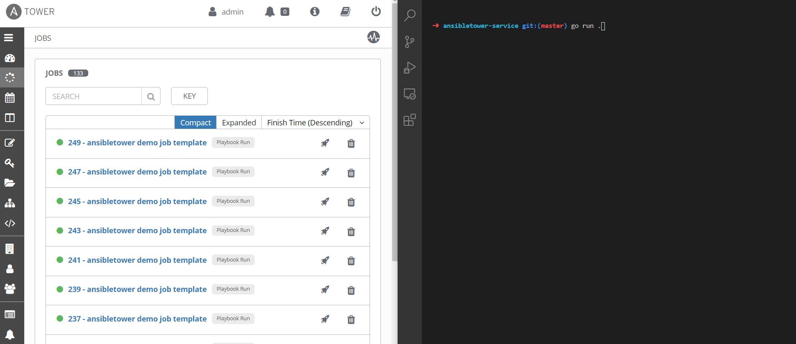
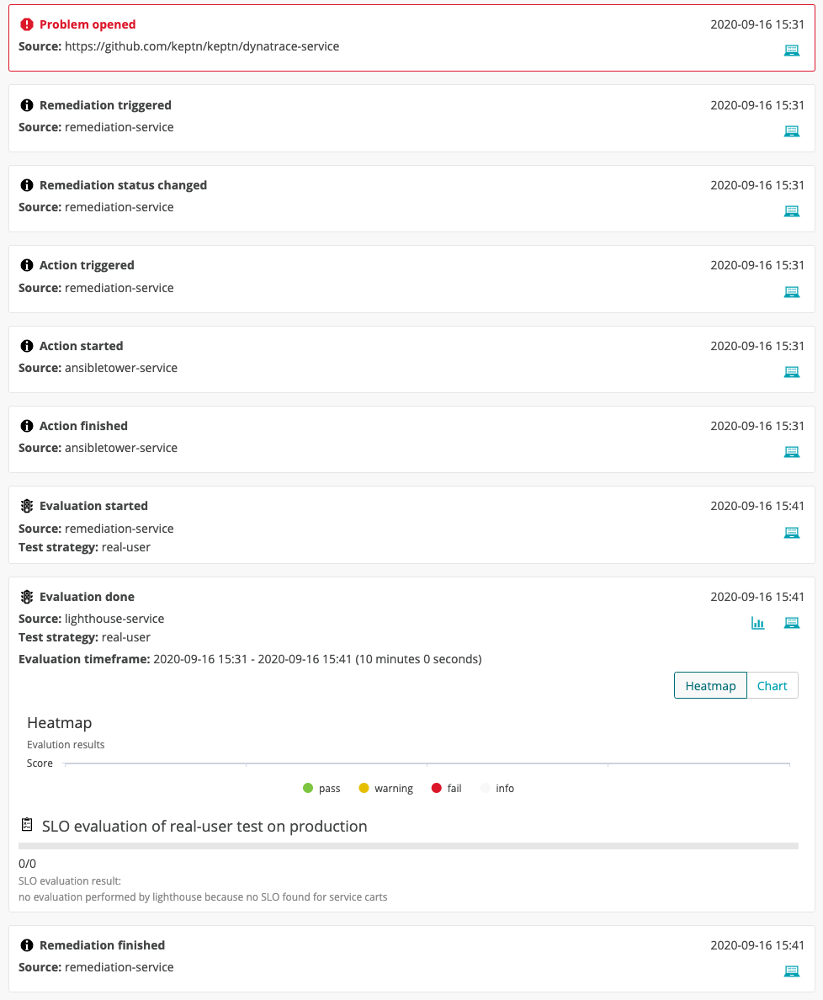

# Ansible Tower service


[](https://goreportcard.com/report/github.com/keptn-sandbox/ansibletower-service)

:warning: Please note that this is a work in progress. We are happy to accept contributions - please file an issue or a PR!

## Demo flow
Here's a current example of the ansibletower-service (on the right) receiving an event and launching the job template on Ansible Tower (on the left). The ansibletower-service then waits for the job to finish.

The following steps are executed in the demo workflow:
1. Keptn receives a problem notification / alert 
1. Keptn kicks off the [remediation workflow](https://keptn.sh/docs/0.7.x/automated_operations/) 
1. Keptn takes a look at the remediation.yaml and will trigger the first remediation action (Ansible Tower job template launch in our case)
1. The Ansible Tower service is triggered 
1. This service triggers the job template launch with the specified ID in Ansible Tower
1. The service waits for the job to finish
1. The service informs Keptn that the job is successfully finished
1. Keptn triggers the evaluation of the remediation 
1. Done - we have now successfully triggered a remediation action via Keptn and this Ansible Tower integration and Keptn even did the evaluation if the remediation was successful!



If you want to install this integration, please continue reading.

# Pre-requisites
- Ansible Tower instance
    - Red Hat offers a [free trial](https://www.redhat.com/en/technologies/management/ansible/try-it) 
    - You will need to have an endpoint for the Ansible Tower that is reachable from the Kubernetes cluster Keptn is installed in
    - You will need to create an OAuth2 "Personal Access Token" or an "Application Token" (also called "authorized token") that is associated with a resource that has permission to launch job templates.
- [Keptn](https://keptn.sh) installed in a Kubernetes cluster
    - Learn how to [install Keptn](https://tutorials.keptn.sh/?cat=installation)

This project is currently being developed and tested with: keptn 0.7.1, Kubernetes 1.16.10, Istio 1.6.5, Tower 3.7.0 (Ansible 2.9.7).

# Installation & Usage

1. Create Kubernetes secret with the necessary parameters.

    Please note that the *Ansible Tower host* has to be __without__ any prefix or postfix. E.g, correct is: _54.43.43.2_ if you only have an IP. Not correct is ~~https://54.43.43.2/~~

    ```
    kubectl -n keptn create secret generic ansibletower --from-literal="ansibletower-host=(your host)" --from-literal="ansibletower-token=(your token)"
    ```

    Note: change the values between parentesis to match your Ansible Tower instance

1. Deploy Ansible Tower action provider
    
    Install the Ansible Tower service for Keptn by applying the provided yaml file (latest version).
    
    ```
    kubectl apply -f https://raw.githubusercontent.com/keptn-sandbox/ansibletower-service/master/deploy/service.yaml
    ```
    This will install the Ansible Tower service in the Keptn namespace.

# TODO describe how to setup a demo playbook in Ansible Tower. we could add the demo playbook also in this repo for users to reuse

# Demo use case: Onboard sample application

1. Clone the Keptn demo repo: 
    ```
    git clone https://github.com/keptn/examples.git
    ```

1. Move to the correct folder: 
    ```
    cd examples/onboarding-carts
    ```

1. If you are running a command-line remote to the cluster, open a new prompt and forward the port for the configuration service.

    ```
    kubectl -n keptn port-forward service/api-gateway-nginx 8080:80 >/dev/null &
    ```

1. The next steps assume you already have Keptn installed (both the CLI and in the cluster), check pre-requisites if not.

    ```
    keptn create project sockshop --shipyard=./shipyard.yaml

    keptn onboard service carts-db --project=sockshop --chart=./carts-db --deployment-strategy=direct

    keptn onboard service carts --project=sockshop --chart=./carts

    keptn send event new-artifact --project=sockshop --service=carts-db --image=docker.io/mongo --tag=4.2.2

    keptn send event new-artifact --project=sockshop --service=carts --image=docker.io/keptnexamples/carts --tag=0.11.1
    ```

1. Next we are going to write a simple remediation file that we are adding to Keptn. Please copy the following contents into a file called `remediation-tower.yaml`. Please refer to https://keptn.sh/docs/concepts/automated_operations for more information.

    Please note to change the value of the `JobTemplate` to trigger to the value of your job template in Ansible Tower.

    ```
    apiVersion: spec.keptn.sh/0.1.4
    kind: Remediation
    metadata:
    name: remediation-service
    spec:
    remediations:
        - problemType: ansibletower service test event
        actionsOnOpen:
            - name: Test event
            description: Testing the Ansible Tower integration
            action: job_template_launch
            value:
                JobTemplate: "9"
    ```

1. Add remediation file to keptn.

    ```
    keptn add-resource --project=sockshop --stage=production --service=carts --resource=remediation-tower.yaml --resourceUri=remediation.yaml
    ```

    Note: the name of the remediation file must be `remediation.yaml`.

1.  Dummy test event

    Save the contents to a file, it doesn't matter which name you use.
    ```
    {
        "type": "sh.keptn.event.problem.open",
        "specversion": "0.2",
        "source": "https://github.com/keptn/keptn/dynatrace-service",
        "id": "f2b878d3-03c0-4e8f-bc3f-454bc1b3d79d",
        "time": "2020-06-07T07:02:15.64489Z",
        "contenttype": "application/json",
        "data": {
            "State": "OPEN",
            "ProblemID": "ab81-941c-1245",
            "ProblemTitle": "ansibletower service test event",
            "project": "sockshop",
            "stage": "production",
            "service": "carts"
        }
    }
    ```

    Note that the `ProblemTitle` value here must exactly match the `problemType` value in the remediation file.

1. Send event

    Send the event to trigger the remediation action.

    ```
    keptn send event --file=./(your test file).json
    ```

    Note: change the value between parentesis to match the file name you used for the dummy event.

1.  Optionally you can validate the the logs of the `ansibletower-service` pod.

    Example of log:

    ```
    2020-08-29T21:02:02.871186504Z 2020/08/29 21:02:02 Starting ansibletower-service...
    2020-08-29T21:02:02.871231707Z 2020/08/29 21:02:02     on Port = 8080; Path=/
    2020-08-29T21:02:49.483148809Z 2020/08/29 21:02:49 gotEvent(sh.keptn.event.action.triggered): b6b5f34a-*** - 90803f2c-***
    2020-08-29T21:02:49.48317131Z 2020/08/29 21:02:49 Processing Action Triggered Event
    2020-08-29T21:02:49.483250315Z 2020/08/29 21:02:49 Handling Action Triggered Event: 90803f2c-***
    2020-08-29T21:02:49.483270517Z 2020/08/29 21:02:49 Supported action: job_template_launch
    2020-08-29T21:02:58.973659794Z 2020/08/29 21:02:58 /api/v2/jobs/271/
    2020-08-29T21:02:58.973702697Z 2020/08/29 21:02:58 action execute successfully. status code: 201
    2020-08-29T21:02:58.973711397Z 2020/08/29 21:02:58 Tick interval 10s
    2020-08-29T21:02:58.973717698Z 2020/08/29 21:02:58 Now waiting for the job to end...
    2020-08-29T21:03:08.973972833Z 2020/08/29 21:03:08 Checking job finished tick 2020-08-29 21:03:08.973726317 +0000 UTC m=+66.127536845
    2020-08-29T21:03:09.140692709Z 2020/08/29 21:03:09 job status successful
    2020-08-29T21:03:09.140738912Z 2020/08/29 21:03:09 Job finished.
    ```

1. Check bridge event stream.

    

1. Check Ansible Tower UI

    


# Next steps & Future improvements

- Validate the result of the action and send the correct values in the `ActionResult`
- Parameterize certificate skipping

